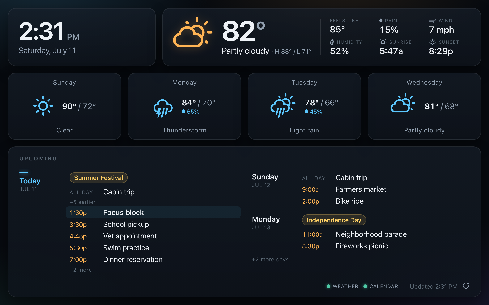
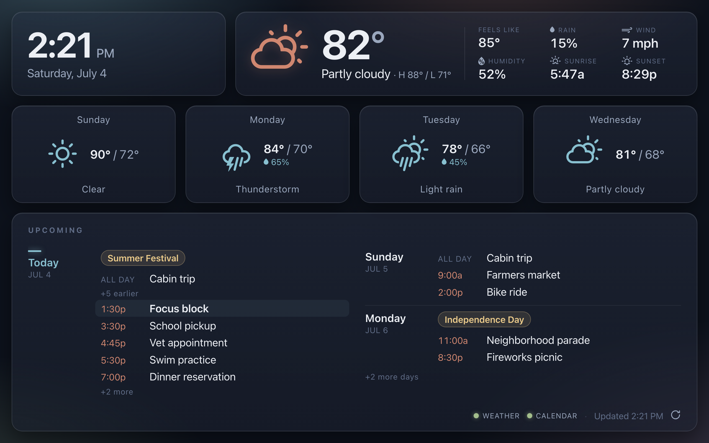
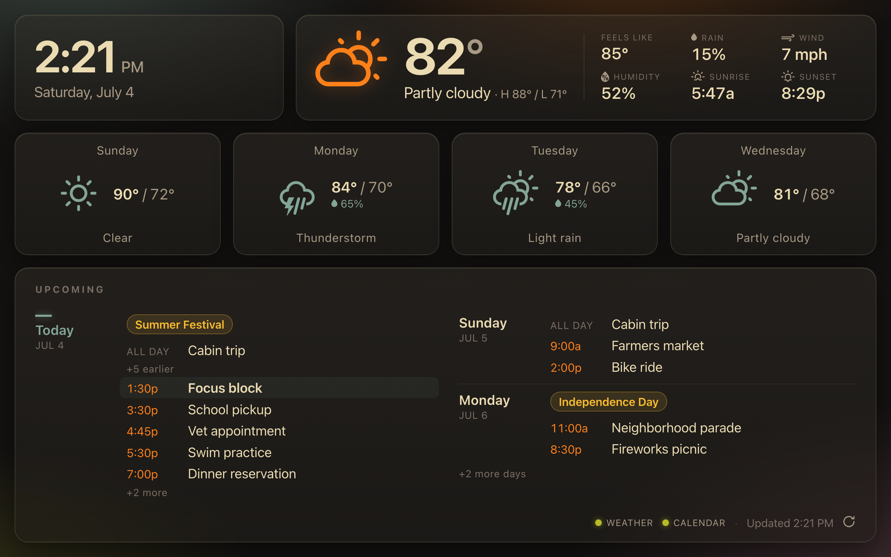
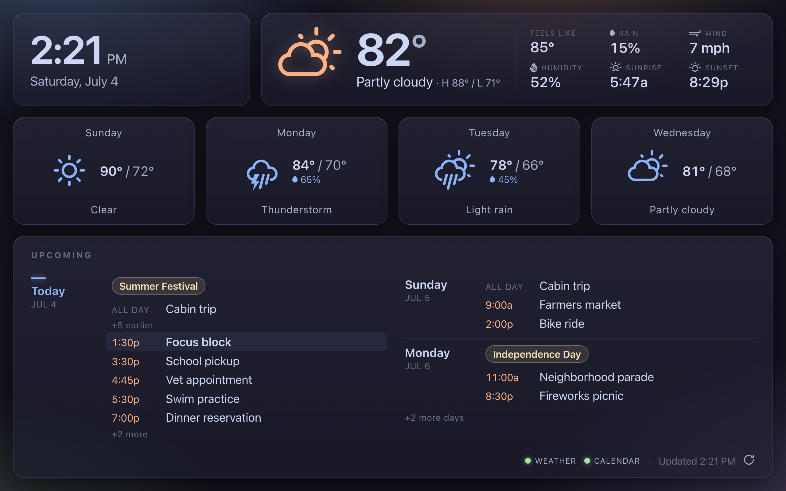

# pi-dashboard

A weather & calendar dashboard for a wall-mounted Raspberry Pi 5 touchscreen
(Pi OS Lite + labwc + Chromium kiosk). FastAPI backend serves a static dashboard
that the on-Pi Chromium kiosk points at over `http://localhost`.



*Mockup rendered by the real app from fabricated sample data (no live fetch, no
real calendar) — generated by `tools/mockup.py`, which injects a fixture cache
into a locally-run server and screenshots it with headless Chrome. The frame exercises most UI states:
forecast cards with and without the precip line, holiday/observance pills, a
multi-day all-day span repeating across days, the in-progress "next up"
highlight, roll-off of past events ("+N earlier"), and agenda overflow
("+N more", "+N more days").*

See the build plan and spec (Obsidian vault) for the full design.

## Requirements

- Python 3.13.5 (pinned via `.python-version`; provisioned by `uv`)
- [`uv`](https://docs.astral.sh/uv/) for dependency / venv management

## Setup

```sh
uv sync                 # create the venv, install deps from uv.lock
cp .env.example .env     # then fill in PROTON_ICS_URL (see Secrets below)
```

## Run

```sh
uv run uvicorn app.main:app --reload    # dev (Mac): http://127.0.0.1:8000
```

`/healthz` returns `{"status": "ok"}`. The static dashboard is served at `/`
(with `Cache-Control: no-cache` so a deploy's new bundle is picked up on the next
load rather than a stale cached copy), and `/api/data` serves the normalized
weather/calendar contract the dashboard polls (a background loop refreshes it).
The JS unit tests run with `node --test` from `static/`.

### Themes

The palette is centralized in `:root` custom properties in `static/style.css`
(every tint and glow is `color-mix()`-derived from them), so an alternate dark
palette is a pure `:root` override block in `static/themes/<name>.css` — see
`static/themes/nord.css` for the contract. Apply one with `THEME=<name>` in
`.env`: the server exposes it at `/theme.css`, linked after `style.css` so it
wins the cascade (an unset or invalid name degrades to the built-in palette).
Preview a theme against the mockup fixture without touching `.env`:

```sh
uv run python -m tools.mockup --theme nord          # -> docs/mockup-nord.png
uv run python -m tools.mockup --theme nord --serve  # browse it live instead
```

The bundled themes, rendered by that command from the same fixture data as the
mockup at the top (which shows the built-in palette — click any image for full
size):

| `nord` | `gruvbox` | `catppuccin` |
| --- | --- | --- |
|  |  |  |

## Deploy (Pi)

Production runs on the Pi as systemd user services (backend + labwc + Chromium
kiosk) plus root-level system config. See [`deploy/README.md`](deploy/README.md)
for the storage decision, install steps, quiet-boot tokens, and the on-Pi
acceptance checklist.

## Test / lint

```sh
uv run pytest
uv run ruff check .
uv run ruff format .
uv run mypy             # strict type-check gate (app + tests)
npx -y -p typescript tsc -p static/jsconfig.json   # type-check app.js against the JSDoc contract
```

(JS unit tests run with `node --test` from `static/`, as above.)

## Secrets & data handling

`PROTON_ICS_URL` is the Proton Calendar "Full view" ICS link. **The URL embeds the
decryption key inline**, so it is a credential *and* exposes calendar PII (event
titles, descriptions, participants, locations). Keep it in 1Password; put it only
in the git-ignored `.env`; never commit it, paste it into logs/shell history, or
share it. This is a personal project on a personal GitHub account by design — the
calendar PII stays out of any org tooling.

## Attribution

Weather data by [Open-Meteo.com](https://open-meteo.com/), licensed under
[CC BY 4.0](https://creativecommons.org/licenses/by/4.0/).
