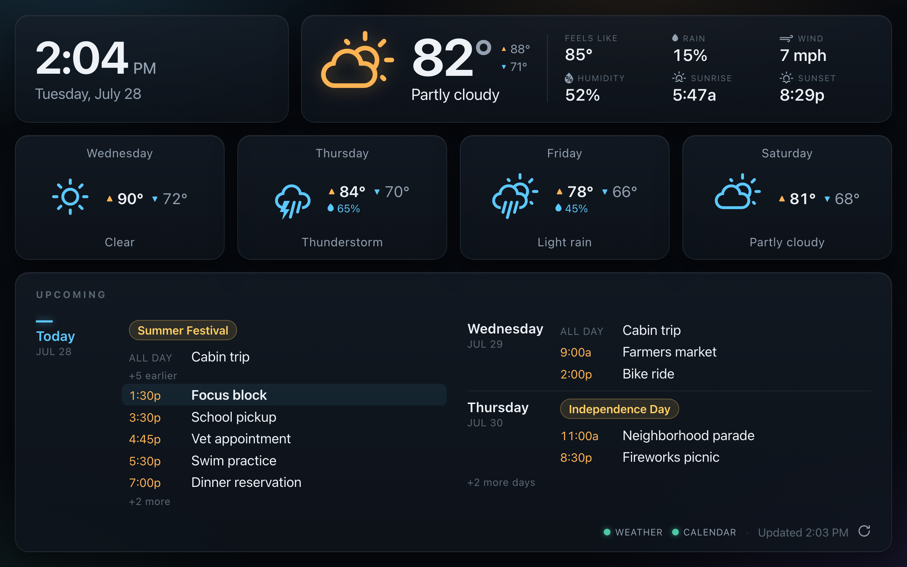
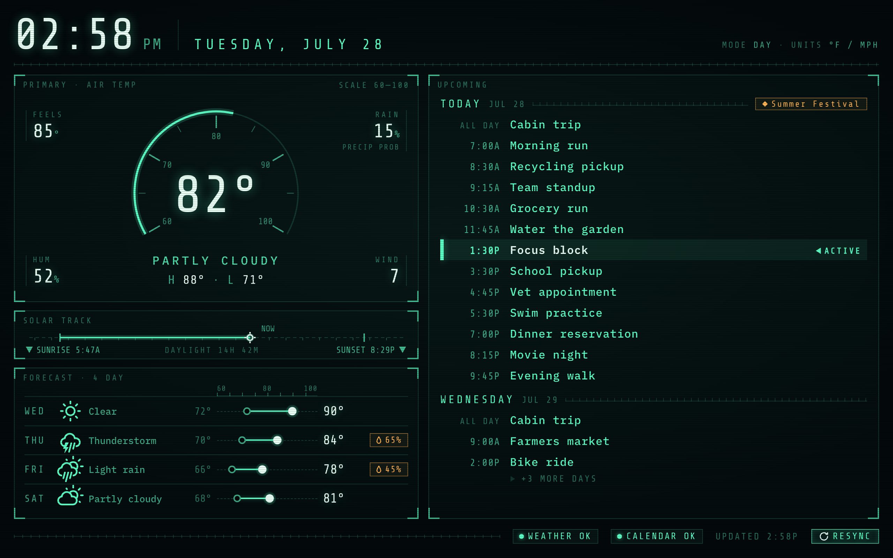
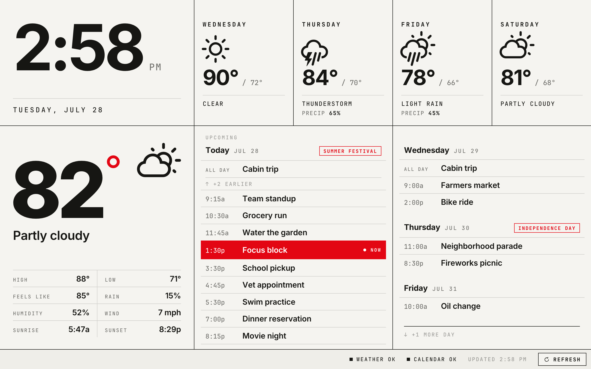
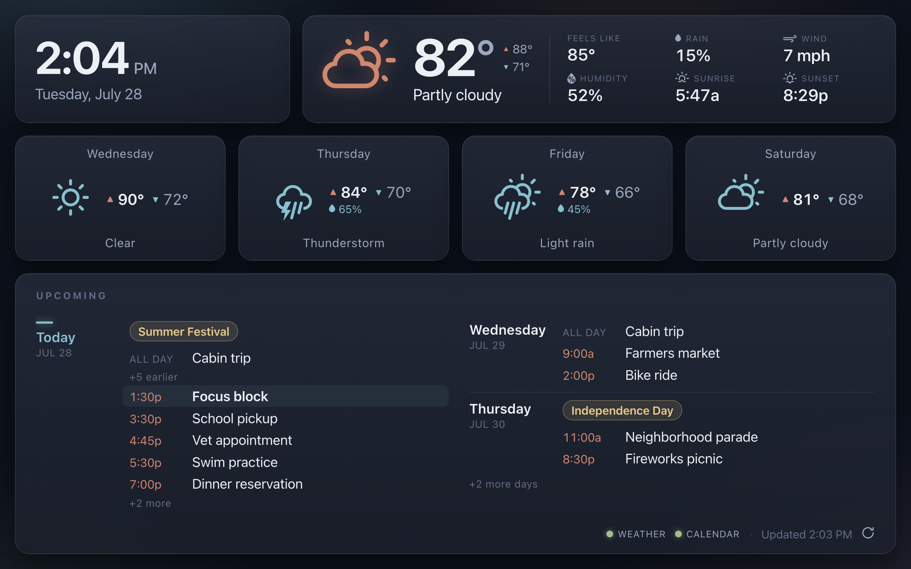
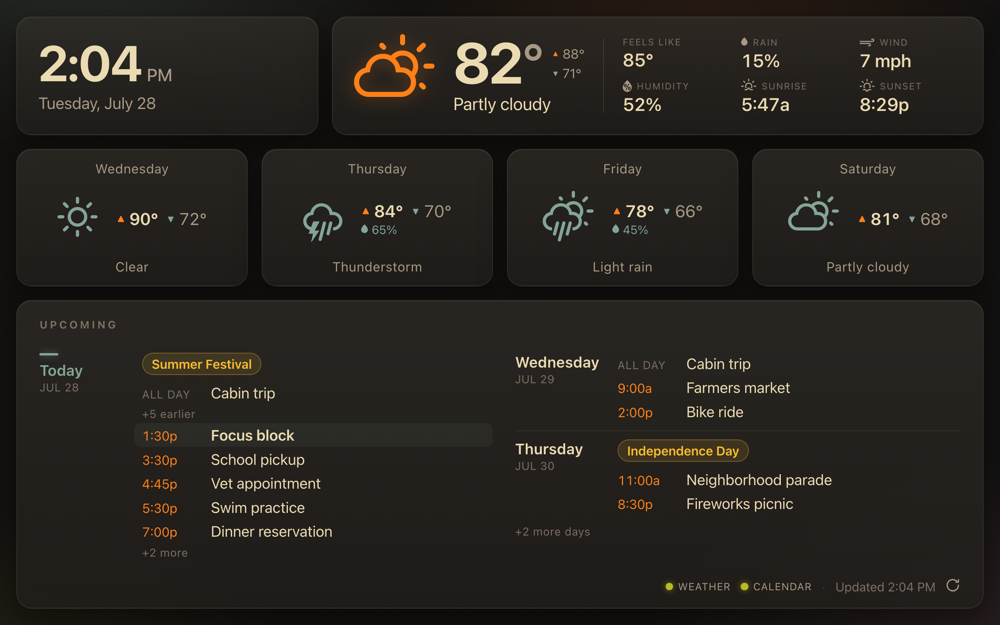
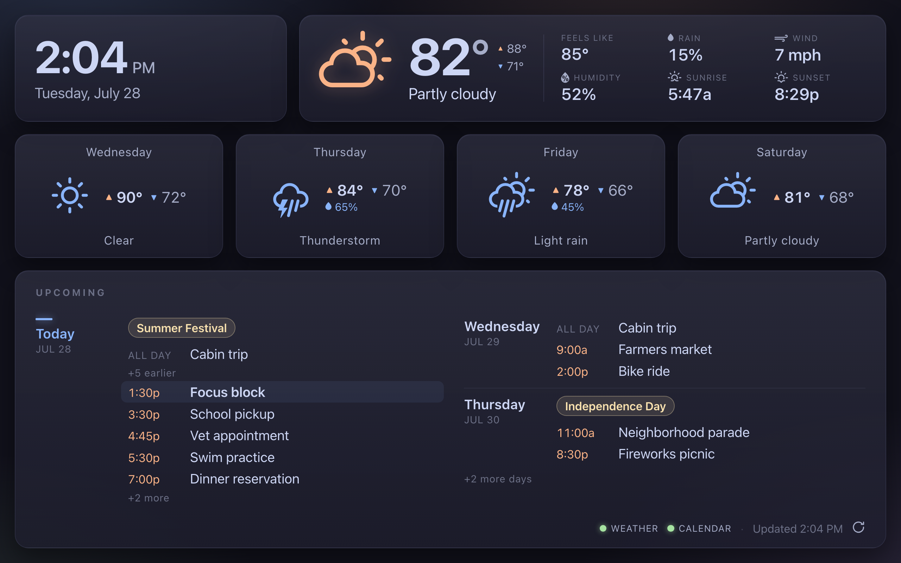
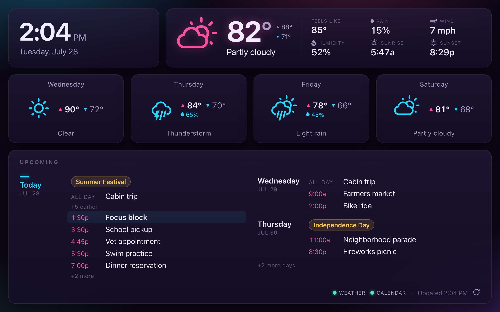

# pi-dashboard

A weather & calendar dashboard for a wall-mounted Raspberry Pi 5 touchscreen
(Pi OS Lite + labwc + Chromium kiosk). FastAPI backend serves a static dashboard
that the on-Pi Chromium kiosk points at over `http://localhost`.



*Mockup rendered by the real app from fabricated sample data (no live fetch, no
real calendar): `tools/mockup.py` injects a fixture cache into a locally-run
server and screenshots it with headless Chrome. The frame exercises most UI states:
forecast cards with and without the precip line, holiday/observance pills, a
multi-day all-day span repeating across days, the in-progress "next up"
highlight, roll-off of past events ("+N earlier"), and agenda overflow
("+N more", "+N more days").*


## Requirements

- Python 3.13.5 (pinned via `.python-version`; provisioned by `uv`)
- [`uv`](https://docs.astral.sh/uv/) for dependency / venv management

## Setup

```sh
uv sync                 # create the venv, install deps from uv.lock
cp .env.example .env     # then fill in PROTON_ICS_URL (see Secrets below)
```

## Run

```sh
uv run uvicorn app.main:app --reload    # dev (Mac): http://127.0.0.1:8000
```

`/healthz` returns `{"status": "ok"}`. The static dashboard is served at `/`
(with `Cache-Control: no-cache` so a deploy's new bundle is picked up on the next
load rather than a stale cached copy), and `/api/data` serves the normalized
weather/calendar contract the dashboard polls (a background loop refreshes it).
The JS unit tests run with `node --test` from `static/`.

### Frontend architecture

The dashboard is a small ES-module graph, not one script - three layers, each
with one job:

- **Server routes** (`app/main.py`) pick the skin from config and serve it:
  `/theme.css` (THEME), `/layout.css` + `/layout.js` (LAYOUT), and the no-cache
  static mount.
- **Layout-agnostic core** (`static/core/`) owns *when* to render: `machine.js`
  is the fetch / 15-min poll / 30-s retry / midnight-rollover / live-clock state
  machine; `contract.js` mirrors the backend data contract as JSDoc typedefs;
  `time.js` / `agenda.js` / `format.js` / `dom.js` are the pure helpers.
- **Per-layout modules** (`static/layouts/<name>/`) own *what* renders and all of
  their own DOM/CSS. A layout is an ES module exporting a `layout` object that
  implements the seven-hook `Layout` interface (`static/core/contract.js`):
  `mount`, `renderClock`, `renderCurrent`, `renderForecast`, `renderAgenda`,
  `renderStatus`, `renderUnavailable`.

`static/app.js` is a thin bootstrap: it imports the core state machine
and the layout (from the server's `/layout.js` route - a generated re-export of
the LAYOUT-selected module) and calls `createApp(layout).init()`, guarded by
`typeof document` so the pure core still imports cleanly under `node --test`.
The mount is wrapped so a layout that throws can't blank the kiosk.

### Layouts

`LAYOUT=<name>` selects which UI renders - the name of a directory under
`static/layouts/`. Built-in layouts:

- `classic` (default) - the production bento-over-ambient-glow UI.
- `hud` - an instrument-HUD design (240° temperature dial, solar day-tape,
  forecast range plot), using the self-hosted subset mono fonts vendored under
  `static/vendor/fonts/`.
- `swiss-mono` - a swiss-grotesque "exposed grid" paper design (Inter + JetBrains
  Mono, self-hosted subsets under `static/vendor/fonts/`). It is a **fixed light**
  layout: its palette is layout-local, so unlike classic/hud it does not respond
  to THEME.

Like THEME, it is env-driven and read at startup, so a change needs a backend
restart to apply. The name is slug-validated and the selection fail-softs to
`classic`: both a non-slug value and a valid-but-absent module serve the classic
module (the kiosk must never blank, and a typo must not 404 the ES-module graph
at load time); `/layout.css` for a bad slug degrades to empty CSS.

LAYOUT and THEME are orthogonal. A hue theme (`nord` / `gruvbox` / `catppuccin`)
retints whatever layout is active through the `base < layout < theme` cascade -
the HUD deliberately keeps its hot-tier colors in CSS classes so a palette can
retint it too. `synthwave` is an *effect theme*: it reaches past the palette into
classic-layout selectors (the hero temp's neon `text-shadow`), so it stays
classic-coupled. The exception is `swiss-mono`, whose palette is layout-local
(not a `:root` override), so a THEME has nothing to bind to - it stays fixed light.

Preview a layout against the mockup fixture without touching `.env`:

```sh
uv run python -m tools.mockup --layout hud          # -> docs/mockup-hud.png
uv run python -m tools.mockup --layout hud --serve  # browse it live instead
```

The bundled layouts, rendered by that command from the same fixture data as the
themes below (`classic` is the mockup at the top - click any image for full size):

| `classic` (default) | `hud` | `swiss-mono` |
| --- | --- | --- |
|  |  |  |

### Themes

The palette is centralized in `:root` custom properties in `static/style.css`
(every tint and glow is `color-mix()`-derived from them), so an alternate dark
palette is a pure `:root` override block in `static/themes/<name>.css` - see
`static/themes/nord.css` for the contract. Apply one with `THEME=<name>` in
`.env`: the server exposes it at `/theme.css`, linked after `style.css` so it
wins the cascade (an unset or invalid name degrades to the built-in palette).
Preview a theme against the mockup fixture without touching `.env`:

```sh
uv run python -m tools.mockup --theme nord          # -> docs/mockup-nord.png
uv run python -m tools.mockup --theme nord --serve  # browse it live instead
```

The bundled themes, rendered by that command from the same fixture data as the
mockup at the top (which shows the built-in palette - click any image for full
size):

| `nord` | `gruvbox` | `catppuccin` | `synthwave` |
| --- | --- | --- | --- |
|  |  |  |  |

`synthwave` is an *effect theme*: on top of the palette it boosts the ambient
glows and adds a neon text-shadow to the hero temperature (documented
deviations from the hue-only contract - see `static/themes/nord.css`).

### Weather sources

Current conditions and the forecast default to [Open-Meteo](https://open-meteo.com/)
(no key needed). Optionally, set `NWS_STATION=<station id>` in `.env` to overlay
real [National Weather Service](https://www.weather.gov/) station observations on
the hero's current conditions - a measurement instead of a model estimate. US-only,
off by default, and fail-soft: any NWS hiccup falls back to the pure Open-Meteo
hero for that refresh; the forecast cards always stay Open-Meteo. See
`.env.example` for how to find your nearest station (and the `NWS_USER_AGENT`
contact-info note). The Open-Meteo forecast model is selectable via
`WEATHER_MODEL` (default `best_match`).

## Deploy (Pi)

Production runs on the Pi as systemd user services (backend + labwc + Chromium
kiosk) plus root-level system config. See [`deploy/README.md`](deploy/README.md)
for the storage decision, install steps, quiet-boot tokens, and the on-Pi
acceptance checklist.

## Test / lint

```sh
uv run pytest
uv run ruff check .
uv run ruff format .
uv run mypy             # strict type-check gate (app + tests)
npx -y -p typescript tsc -p static/jsconfig.json   # type-check the frontend module graph (core/ + all layouts) against the JSDoc contract
```

(JS unit tests run with `node --test` from `static/` - the core and per-layout
`*.test.js` suites, `app.test.js` plus the HUD's `hud.test.js` / geometry tests.)

## Secrets & data handling

`PROTON_ICS_URL` is the Proton Calendar "Full view" ICS link. **The URL embeds the
decryption key inline**, so it is a credential *and* exposes calendar PII (event
titles, descriptions, participants, locations). Keep it in 1Password; put it only
in the git-ignored `.env`; never commit it, paste it into logs/shell history, or
share it. This is a personal project on a personal GitHub account by design - the
calendar PII stays out of any org tooling.

## Attribution

Weather data by [Open-Meteo.com](https://open-meteo.com/), licensed under
[CC BY 4.0](https://creativecommons.org/licenses/by/4.0/). When `NWS_STATION` is
set, current conditions come from the
[National Weather Service](https://www.weather.gov/) (US-government public
domain).
